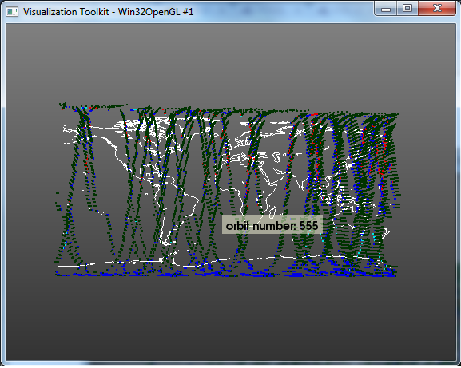
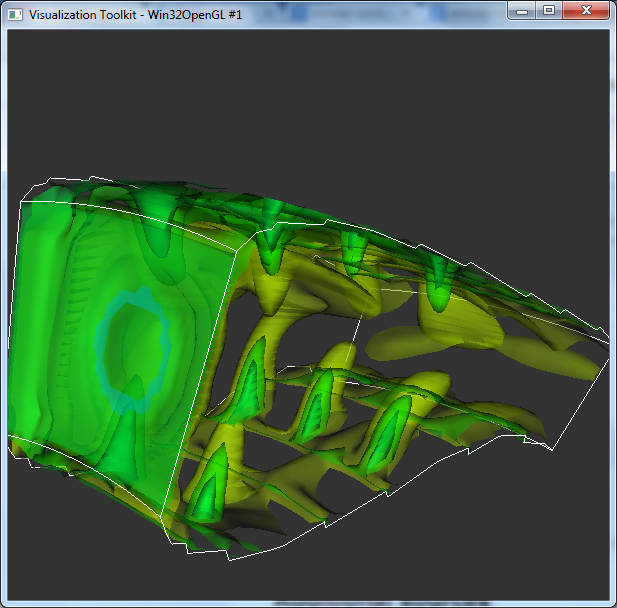
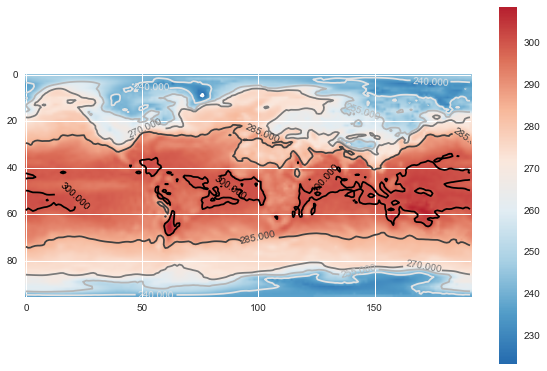

#vtk-python Tutorial

This repository contains some iPython notebooks with vtk-python examples

## Satellite data

Displays data from the  [SCIVIS Contest 2014](http://www.viscontest.rwth-aachen.de/data.html), which contains information from satellites near volcano eruptions. 

[nbviewer](http://nbviewer.ipython.org/github/diego0020/tutorial-vtk-python/blob/master/satellite_example.ipynb)

## Volumetric data

Based on a [vtk-example](http://www.vtk.org/Wiki/index.php?title=VTK/Examples/Cxx/Visualization/StreamLines) shows various techniques to visualize volumetric data. 

[nbviewer](http://nbviewer.ipython.org/github/diego0020/tutorial-vtk-python/blob/master/volumes_example.ipynb)

## Images and color mapping (not vtk)

Two examples of how to look at 2D data and apply color tables, this examples only uses matplotlib.

[nbviewer Medical data](http://nbviewer.ipython.org/github/diego0020/tutorial-vtk-python/blob/master/color_map_med.ipynb)

[nbviewer Climate data](http://nbviewer.ipython.org/github/diego0020/tutorial-vtk-python/blob/master/color_map_world.ipynb)
